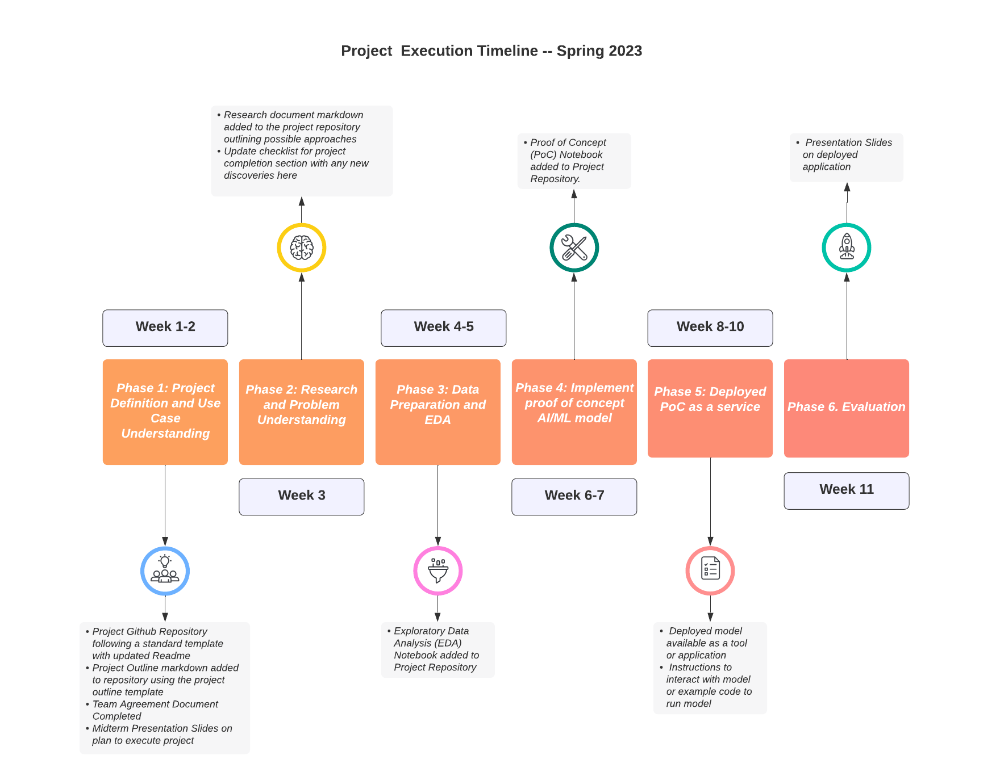

# How to Structure a Machine Learning or Data Science Project

The purpose of this document is to provide machine learning and data science project groups with some guidelines on how to best structure their projects in a way that encourages consistent workflows across projects and promotes collaboration. This document is based off of Red Hat's ET team's [data science workflows](https://github.com/aicoe-aiops/data-science-workflows) documentation.

Following is a timeline that can be followed for the projects.

# How do I manage my project?

Organizational overhead can be an easily overlooked, and a potentially crippling oversight for a new data science project. To make things worse, data science is still a relatively new discipline and the right tools and methodologies for project management are still being figured out.

The approach to overcoming this issue can simply be to focus on the fewest number of tools possible. That really comes down to using version control for your repositories, project management boards to organize tasks, and a communication method for real time conversations. What do you need to start your project and keep it moving? 

* Project Repository
	* Public repository ([examples](https://github.com/aicoe-aiops))
	* [Helpful bots](https://github.com/apps/khebhut) 
    
* You can also jump start your repo with project templates eg. [cookiecutter](https://github.com/cookiecutter/cookiecutter), or an adaption of it [here](https://github.com/aicoe-aiops/project-template)

* Project Board
	* Github project board ([examples](https://github.com/orgs/aicoe-aiops/projects))
	* Github issue templates ([examples](https://github.com/aicoe-aiops/project-template/tree/master/.github/ISSUE_TEMPLATE))
	* Trello Kanban [template](https://trello.com/templates/engineering/kanban-template-LGHXvZNL)

* Communication Channel
	* Project channel(s) ([example](https://join.slack.com/t/operatefirst/shared_invite/zt-o2gn4wn8-O39g7sthTAuPCvaCNRnLww))

# What are the phases of a data science project?

## Phase 1: Project Definition and Use Case Understanding:

In this phase of the project, project groups will meet with Stakeholders to discuss the projects, available data and desired outcomes, use cases and end-users. 

Groups will also come up with a team agreement which documents how the team will function. Establishing ethical, equitable, and supportive processes enables teams to achieve and maintain high performance.

* To start, project groups should create a repository and include a README with an initial outline of the project.

* With the help of the information provided by the stakeholders, project groups come up with a "project outline" consisting of the description of any available data or similar projects and the desired outcomes and end-users of this intelligent application. Please feel free to start with [this template](./project-outline-template.md) for inspiration.

The project outline can include: 

1. A concrete checklist of items or deliverables that define when the project is complete (subject to ongoing review).

2. Defined performance criteria and success metrics that will be used to evaluate the success of the machine learning models.   

3. An alternative solution written in terms as though it would be solved manually by a human without AI, i.e, "I use my eyes to look at a picture and respond that it is or is not a cat based on my knowledge of the appearance of cats". This helps to identify any potential mismatch between desired outcome and available data. 

4. Outline a path to operationalization. Make sure there is some consideration given to the infrastructure, deployment, and user interactions of your projects final form.  
 
Once this is done, you can move on to step 2, OR share your new project proposal with your stakeholders, instructors, to get some feedback.

**Deliverables from Phase 1**:

- [ ] Project Github Repository following a standard template with updated Readme
- [ ] Project Outline markdown added to repository using the project outline template
- [ ] Team Agreement Document Completed
- [ ] Midterm Presentation Slides on plan to execute project

## Phase 2: Research and Problem Understanding:

Now that you have a problem you'd like to solve, its time to do some research! This phase of a project is quite flexible and is bound to be traversed differently by every individual. However, before jumping into any hard-core development its is generally good to make sure to do the following at the bare minimum:

1. Compile and read 3-4 relevant papers on the problem domain. [Papers With Code](https://paperswithcode.com/) and [arxiv](https://arxiv.org/) will be your friends here. 

2. Find 1-2 comparable open source projects and try to deploy them yourself. Maybe the solution you're looking for already exists and you can re-use or contribute to an existing project instead of starting from scratch. 

3. Add a `research.md` doc to your repository outlining the papers and projects explored above. This may be useful to you for reference or documentation later on. Plus, anyone who needs to do the same research in the future will thank you. 

At this phase in the project, teams can present a modified plan for achieving project goal and share with stakeholders for general agreement. This can include: 

* Data Requirements 
* Performance Criteria
* ML approach and reasoning
* Deliverable Artifacts

**Deliverables from Phase 2**:

- [ ] Research document markdown added to the project repository outlining possible approaches
- [ ] Update [checklist for project completion section](project-outline-template.md#b-checklist-for-project-completion) with any new discoveries

## Phase 3: Data Preparation and EDA: 

Time to dig into the data. Before getting right into the Machine Learning development, we think it's best practice to take some focused time to familiarize yourself with the data and to write all the data preparation, processing and management functions you'll need to make life easier in the future. 

1. Work with stakeholders to ensure access to data. Determine the nature of data and store the data appropriately depending on the nature of data (eg: open source, sensitivity, volume).

2. Make sure the data being referenced in code remains consistent and is available and accessible by all contributors. It is important to maintain versions of datasets and store intermediate, processed datasets also along with raw datasets.

3. You can consider using a public/private S3 bucket to store and retrieve large amounts of data. For open source data for requesting a public bucket on the operate-first cluster, you can request one [here](https://github.com/operate-first/support/issues/new?assignees=first-operator&labels=kind%2Fonboarding%2Carea%2Fbucket&template=ceph_bucket_request.yaml&title=BUCKET%3A+%3Cname%3E) by opening an issue. Another way to store the data can be directly on the Github repository. Discuss the data storage method with your stakeholders and make sure that there is consensus.

3. Work with stakeholders to create description of data/metadata. Determine if we need SME labeled or augmented data at this stage. Think of ways to explore the initial data provided before generating augmented data or looking for alternate data sources.

4. Develop an EDA Notebook to help explain to others (and your future self) what the data looks like and what it represents.

5. Write all necessary ETL, data cleaning and preprocessing code. 

6. Select and separate immutable training, testing and evaluation datasets. Store each separately in your storage system.   

7. Make any required updates to the project Readme/plan if needed due to discoveries in the data set.  

**Deliverables from Phase 3**:

- [ ] Exploratory Data Analysis (EDA) Notebook added to Project Repository

## Phase 4: Implement proof of concept AI/ML model:

Here is were we start to do some ML exploration and put together our bare-bones MVP (minimum viabl) application. 

1. Create a jupyter notebook and start experimenting with different models and approaches until your results meet the performance criteria defined earlier. At this stage there are a number of options for experiment tracking, eg: [ml flow](https://mlflow.org/), [kubeflow pipelines](https://www.kubeflow.org/docs/components/pipelines/introduction/).

2. Clean up your experimental notebook so that another group member or data scientist would be able to follow the logic, re-run it and understand your results. This means, clearly written markdown cells, well labeled plots and commented code.     

3. Once your Proof of Concept notebook(s) are done. Push them to your github repo.

4. You can also share your code and documentation as a [Jupyterbook](https://jupyterbook.org/en/stable/intro.html) using [project meteor](https://shower.meteor.zone/)   

Note: Focus on completing an end to end process of deploying an initial version of the model which meets the required criteria rather than focusing on achieving the best possible model for the first deployment. Greater focus should be on creating reproducible code and  models and services that are set up in a way that they be improved in future iterations with more feedback.
Often deploying a working proof of concept model and sharing that with the stakeholders early on in a project, will help create dialogue, fine tune requirements, and can generate good feedback early in the process of a building a machine learning project. By adopting a software engineering mindset and [engineering best practices](https://se-ml.github.io/practices/) for machine learning projects, we can create more reproducible code, faster delivery cycles and better machine learning applications.

**Deliverables from Phase 4**:

- [ ] Proof of Concept (PoC) Notebook added to Project Repository.

## Phase 5: Deployed PoC as a service:

Your work is ready to leave the safety of a jupyter notebook and become a tool, application or service that will become the center of a new intelligent application. Get Excited! 

1. Deploy your model: There are a number of tools out there to make this easy. You can choose to deploy your model as a web service, a dashboard, a github action, as a containerized application. (example: [Seldon serving on Openshift for model deployment](https://github.com/aicoe-aiops/ocp-ci-analysis/blob/master/docs/workshop/model_deployment.md))

2. Document the usage: Write documentation on the usage of your model which highlights how stakeholders can interact with your model. You could write a short notebook that can send and receive inference requests from your model services endpoint to make it easy for stakeholders to test and try out your model. So focus on making their interaction with the model easy.

**Deliverables from Phase 5**:

- [ ] Deployed model as an application or service
- [ ] Instructions to interact with model or example code to run model

## Phase 6. Evaluation:

Now that your model is out in the wild, its a good idea to see if it's actually useful to anyone and evaluate its real world performance. 

1. Share your work on communication channels, or present it at to get people using and testing out your model. 

2. If there are any issues or areas to improve (which there will be) loop back to previous steps in this workflow and repeat until your project meets your desired outcome. 

**Deliverables from Phase 6**:

- [ ] Presentation Slides on deployed application
